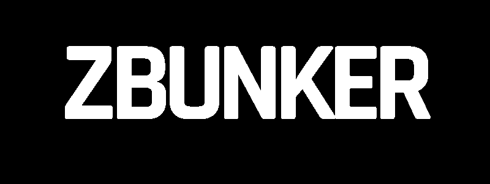

# ZBUNKER

ZBunker is a community run by a bunch of university students with an aim to spread awareness about **open source** and the power of **programmming**.

The main mode of education is through our [YouTube channel](https://www.youtube.com/channel/UC1QZPervOHLiC4xpVnzbDFg), where we will walk you through some of the popular programming languages and how you can develop a skill set in the tech domain.

We believe in ***free and quality education for all***.

## About The Project

*`zbunker-website`* project is focussed on creating an independent website dedicated to ZBunker. This website will feature all the courses, seminars, webinars and other learning resources that will be of great use for learners.

*`zbunker-website`* uses **Flask** as the backend. Check out the [Tech Stack](#tech-stack) section to know about various tech stacks preferred and currently used for creating this website.

## ToDo List

- [x] Create a landing page
- [x] Create interactve, functional homepage
- [x] Create About section
- [x] Add login/register functionality
- [x] Use SQLAlchemy(flask-sqlalchemy :: SQLite DB) to store user creds
- [x] Add anti-CSRF tokens
- [ ] Add video contents
- [ ] Add resources
- [ ] Migrate to PostgreSQL
- [ ] Add forgot password functionality
- [ ] Add Google reCaptcha
- [ ] Deploy rate limit check on login/register (Security)
- [ ] Deploy the website on a public server (Final)

## Tech Stack

1. HTML
2. CSS
3. JavaScript
4. Flask
5. SQLAlchemy (ORM)
6. Jinja2 Template Engine